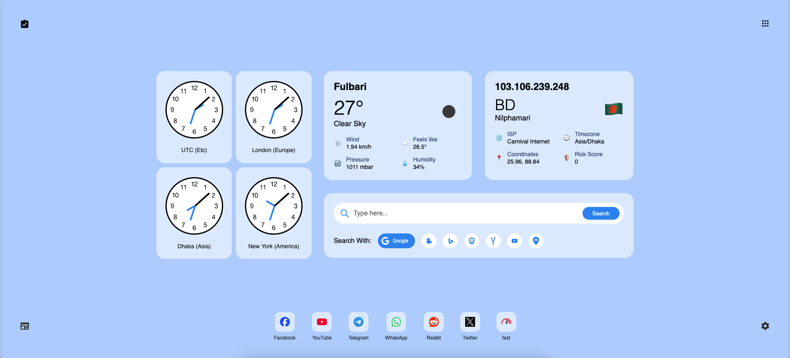

# Material Browser 🌐

A modern, feature-rich new tab replacement with material design aesthetics. Transform your browsing experience with customizable themes, multiple time zones, weather updates, and smart search capabilities.



## ✨ Features

### 🎨 Themes
- Four beautiful pre-designed themes
  - Light Blue (Default)
  - Dark Blue
  - Purple
  - Green
- Smooth transitions between themes
- Persistent theme selection

### ⏰ Multi-timezone Clock
- Display up to 4 different time zones simultaneously
- Real-time updates
- Beautiful analog clock design
- Customizable timezone selection

### 🌤️ Weather Integration
- Real-time weather updates
- Detailed weather information including:
  - Temperature
  - Weather conditions
  - Wind speed
  - Humidity
  - Pressure
  - Feels like temperature
- Location detection
- Manual location override

### 🔍 Smart Search
- Multiple search engine support:
  - Google
  - DuckDuckGo
  - Bing
  - Brave
  - YouTube
  - Yandex
  - Google Maps
- Search suggestions with keyboard navigation
- Customizable autocomplete settings

### 🌍 IP Information
- Display current IP address
- Location information
- ISP details
- Risk score assessment
- Timezone detection
- Coordinates

### 📚 Bookmarks
- Quick access to favorite websites
- Customizable bookmark management
- Favicon support
- Edit and remove capabilities

## 🛠️ Technologies Used
- HTML5
- CSS3
- JavaScript
- jQuery
- Moment.js
- OpenWeather API
- IP Query API

## 🚀 Getting Started

1. Clone the repository
```bash
git clone https://github.com/Bappyllcg/new-tab.git
```
2. Open the `index.html` file in your web browser.

## 🤝 Contributing
Contributions are welcome! If you have any suggestions, bug reports, or feature requests, please open an issue or submit a pull request.

## 📄 License
This project is licensed under the MIT License - see the [LICENSE](LICENSE) file for details.